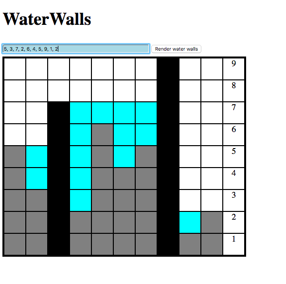

# water-walls
[Mini-app] Water Walls <br>
run `npm install` to download dependencies <br>
run `npm start` to run node <br>
visit `http:localhost:1212` <br>




```Javascript
const waterWalls = (walls) => {
  //constraints: determine which two walls have the most water trapped between them
  // get water blocks on each index
  // keep track of the largest pool of water blocks
}

```

```
input = [5, 3, 7, 2, 6, 4, 5, 9, 1, 2]
output = [3, 8, 11]

complexity:
time: linear
space: linear

strategy
calculate the num of waterblocks on each index by calculating the left and the righ largest, taking the smaller of the two, and subracting from the current if current is smaller. Simultaneously have a check that will keep track of the largest pool size represented by an array of the number of water blocks.

transformation steps
input = [5, 3, 7, 2, 6, 4, 5, 9, 1, 2]
            ^
At index 1
  greatest left is 5
  greatest right is 9
  take smaller value which is 5
  5 is greater than current so subtract
  5 - 3 = 2
  2 water blocks at index 1

  [5, 3, 7, 2, 6, 4, 5, 9, 1, 2]
      ^  ^  ^  ^  ^  ^  ^  ^
      2  0  5  1  3  2  0  1  

  while iterating you can keep track of the pool size
  largestPoolNum = 0
  result = []
  tempNum = 0
  tempArr = [0] // initialize first wall at index 0
  start at index 1 you get a pool size of 2

  continue to add to tempNum until you hit a block with no waterblocks


  largestPoolNum = 0
  result = []
  tempNum = 2
  tempArr = [0]
  when you hit a wall with no waterblocks
  if the tempNum is greater than current Largest
  then you push up the current index + 1 => 2 + 1 => 3 => [0, 3]
  then you push up the tempNum which is 2 => [0, 3, 2]
  and reset the tempNum and tempArr, tempArr is initialized with [i + 1] => [3]

  continue to end of array and return result [3, 8, 11]
```
